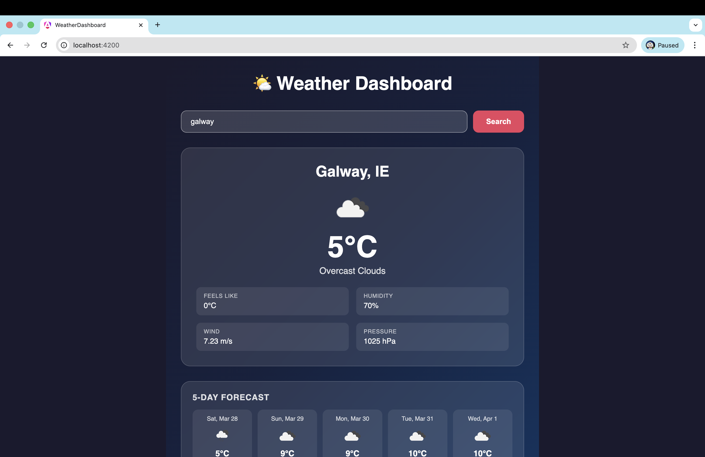

# 🌤 Weather Dashboard

A responsive weather dashboard built with Angular that allows users to search for any city and view current weather conditions along with a 5-day forecast.

## What it does

- Search for any city worldwide
- Displays current temperature, weather condition, feels like, humidity, wind speed and pressure
- Shows a 5-day weather forecast
- Responsive dark-themed UI
- Real-time data from OpenWeatherMap API

## Technologies Used

- **Angular 19** — frontend framework
- **TypeScript** — programming language
- **OpenWeatherMap API** — weather data source
- **Angular HttpClient** — for API requests
- **RxJS Observables** — for handling async data

## Setup Instructions

### Prerequisites
- Node.js (v18 or higher)
- Angular CLI (`npm install -g @angular/cli`)
- OpenWeatherMap API key (free at [openweathermap.org](https://openweathermap.org))

### Steps

1. Clone the repository:
```bash
   git clone https://github.com/g00451291/weather-dashboard.git
   cd weather-dashboard
```

2. Install dependencies:
```bash
   npm install
```

3. Add your API key in `src/app/services/weather.ts`:
```typescript
   private apiKey = 'YOUR_API_KEY_HERE';
```

4. Run the development server:
```bash
   ng serve
```

5. Open your browser at `http://localhost:4200`

## Usage

1. Type any city name into the search bar
2. Press **Search** or hit **Enter**
3. View current weather and 5-day forecast



## AI Acknowledgment

This project was developed with the assistance of AI tools:

**Claude (Anthropic)**
- Guided the overall project architecture and component structure
- Generated boilerplate code for Angular components and services
- Helped debug compilation errors (class naming issues between Angular versions)
- Assisted with CSS styling for the dark theme UI
- Wrote the initial README documentation

All AI-generated code was reviewed, tested, and understood before being used. The final implementation was verified to work correctly and all code logic was understood and explained during development.